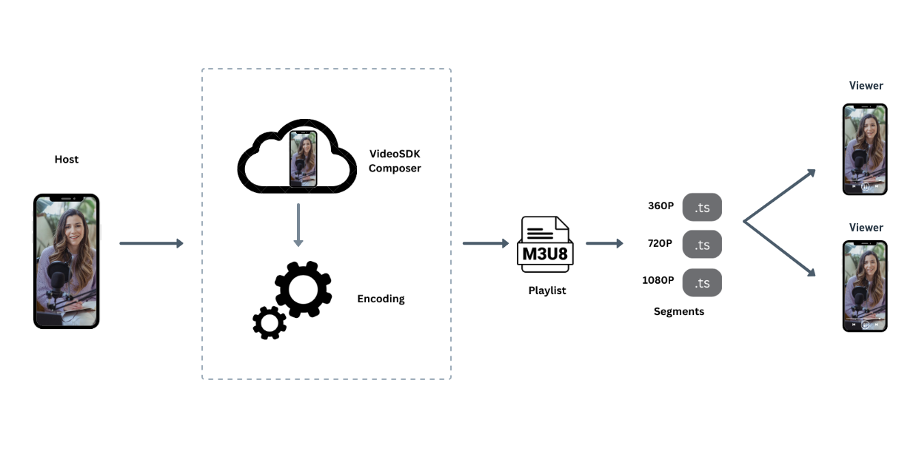
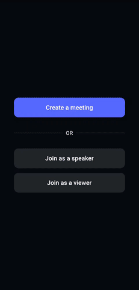
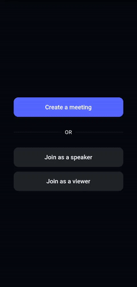
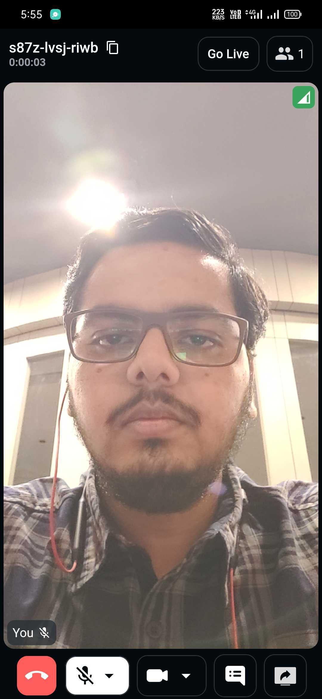
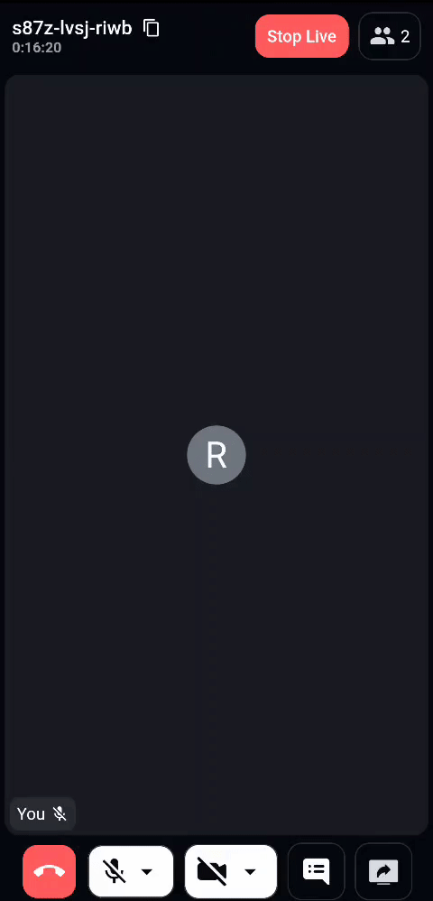
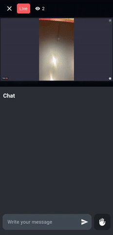
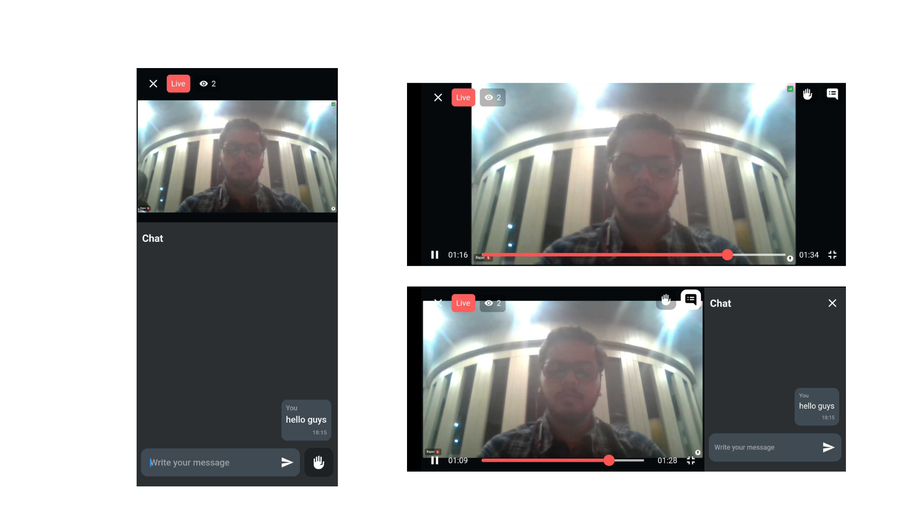

<p align="center">

</p>

---

[](https://docs.videosdk.live/flutter/guide/video-and-audio-calling-api-sdk/getting-started)
[](https://discord.gg/bGZtAbwvab)
[](https://app.videosdk.live/signup)

At Video SDK, we’re building tools to help companies create world-class collaborative products with capabilities of live audio/videos, compose cloud recordings/rtmp/hls and interaction APIs.

## Demo App

📲 Download the sample iOS app here: https://testflight.apple.com/join/RiYh4KQQ

📱 Download the sample Android app here: https://appdistribution.firebase.dev/i/bfe2146c97301aaf

## Interactive Livestream (HLS)

- Interactive live stream (HLS) is a media streaming protocol for delivering visual and audio media to viewers over the internet.
- Interactive live stream (HLS) allows you to distribute content and ensure excellent viewing experiences across devices, playback platforms, and network conditions. It is the ideal protocol for streaming video to large audiences scattered across geographies.

<p align="center">

</p>

- VideoSDK also allows you to configure the interactive livestream layouts in numerous ways like by simply setting different prebuilt layouts in the configuration or by providing your own [custom template](https://docs.videosdk.live/docs/tutorials/customized-layout) to do the livestream according to your layout choice.

<br/>

> **Note** :
>
> With VideoSDK, you can also use your own custom designed layout template to livestream the meetings. In order to use the custom template, you need to create a template for which you can [follow these guide](https://docs.videosdk.live/docs/tutorials/customized-layout). Once you have setup the template, you can use the [REST API to start](https://docs.videosdk.live/api-reference/realtime-communication/start-hlsStream) the livestream with the `templateURL` parameter.

<br/>

## Setup Guide

- Sign up on [VideoSDK](https://app.videosdk.live) and visit [API Keys](https://app.videosdk.live/api-keys) section to get your API key and Secret key.

- Get familiarized with [API key and Secret key](https://docs.videosdk.live/flutter/guide/video-and-audio-calling-api-sdk/signup-and-create-api).

- Get familiarized with [Token](https://docs.videosdk.live/flutter/guide/video-and-audio-calling-api-sdk/server-setup).

## Prerequisites

- If your target platform is iOS, your development environment must meet the following requirements:
  - Flutter 2.0 or later
  - Dart 2.12.0 or later
  - macOS
  - Xcode (Latest version recommended)
- If your target platform is Android, your development environment must meet the following requirements:
  - Flutter 2.0 or later
  - Dart 2.12.0 or later
  - macOS or Windows
  - Android Studio (Latest version recommended)
- If your target platform is iOS, you need a real iOS device.
- If your target platform is Android, you need an Android simulator or a real Android device.
- Valid Video SDK [Account](https://app.videosdk.live/)

<br/>

## Run the Sample Project

### 1. Clone the sample project

Clone the repository to your local environment.

```js
git clone https://github.com/videosdk-live/videosdk-hls-flutter-sdk-example.git
```

### 2. Copy the .env.example file to .env file.

Open your favorite code editor and copy `.env.example` to `.env` file.

```js
$ cp .env.example .env
```

### 3. Modify .env file

Generate temporary token from [Video SDK Account](https://app.videosdk.live/signup).

```js title=".env"
AUTH_TOKEN = "TEMPORARY-TOKEN";
```

### 4. Install the dependecies

Install all the dependecies to run the project.

```js
flutter pub get
```

### 4. Run the sample app

Bingo, it's time to push the launch button.

```js
flutter run
```

<br/>

## Key Concepts

- `Room` - A Room/Meeting represents Real time audio and video communication.

  **`Note : Don't confuse with Room and Meeting keyword, both are same thing 😃`**

- `Sessions` - A particular duration you spend in a given meeting is a referred as session, you can
  have multiple session of a particular meetingId.
- `Participant` - Participant represents someone who is attending the meeting's
  session, `local partcipant` represents self (You), for this self, other participants
  are `remote participants`.
- `Stream` - Stream means video or audio media content that is either published
  by `local participant` or `remote participants`.
- `Mode` - There are 2 types of modes:
  1. `CONFERENCE`: Both audio and video streams will be produced and consumed in this mode.
  2. `VIEWER`: Audio and video streams will not be produced or consumed in this mode.

<br/>

## Android Permission

Add all the following permissions to AndroidManifest.xml file.

```
    <uses-feature android:name="android.hardware.camera" />
    <uses-feature android:name="android.hardware.camera.autofocus" />
    <uses-permission android:name="android.permission.RECORD_AUDIO" />
    <uses-permission android:name="android.permission.INTERNET" />
    <uses-permission android:name="android.permission.READ_PHONE_STATE" />
    <uses-permission android:name="android.permission.CAMERA" />
    <uses-permission android:name="android.permission.ACCESS_NETWORK_STATE" />
    <uses-permission android:name="android.permission.CHANGE_NETWORK_STATE" />

    <!-- Needed to communicate with already-paired Bluetooth devices. (Legacy up to Android 11) -->
    <uses-permission
        android:name="android.permission.BLUETOOTH"
        android:maxSdkVersion="30" />
    <uses-permission
        android:name="android.permission.BLUETOOTH_ADMIN"
        android:maxSdkVersion="30" />

    <!-- Needed to communicate with already-paired Bluetooth devices. (Android 12 upwards)-->
    <uses-permission android:name="android.permission.BLUETOOTH_CONNECT" />

```

## iOS Permission

Add the following entry to your Info.plist file, located at `<project root>/ios/Runner/Info.plist`:

```
<key>NSCameraUsageDescription</key>
<string>$(PRODUCT_NAME) Camera Usage!</string>
<key>NSMicrophoneUsageDescription</key>
<string>$(PRODUCT_NAME) Microphone Usage!</string>
```

## iOS Screen share Setup

Please refer to this documentation guide to [setup screenshare for iOS](https://docs.videosdk.live/flutter/guide/video-and-audio-calling-api-sdk/extras/flutter-ios-screen-share)

<br/>

## Token Generation

Token is used to create and validate a meeting using API and also initialise a meeting.

🛠️ `Development Environment`:

- For development, you can use temporary token. Visit VideoSDK [dashboard](https://app.videosdk.live/api-keys) to generate temporary token.

🌐 `Production Environment`:

- For production, you have to set up an authentication server to authorize users. Follow our official example repositories to setup authentication server, [videosdk-rtc-api-server-examples](https://github.com/videosdk-live/videosdk-rtc-api-server-examples)

<br/>

## API: Create and Validate meeting

- `create meeting` - Please refer this [documentation](https://docs.videosdk.live/api-reference/realtime-communication/create-room) to create meeting.
- `validate meeting`- Please refer this [documentation](https://docs.videosdk.live/api-reference/realtime-communication/validate-room) to validate the meetingId.

<br/>

## [Create a Room](https://docs.videosdk.live/flutter/api/sdk-reference/videosdk-class/methods#createroom)

- You can initialize the meeting using `createRoom()` method. `createRoom()` will generate a new `Room` object and the initiated meeting will be returned.

```js
  Room room = VideoSDK.createRoom(
        roomId: "abcd-efgh-ijkl",
        token: "YOUR TOKEN",
        displayName: "GUEST",
        micEnabled: true,
        camEnabled: true,
        maxResolution: 'hd',
        defaultCameraIndex: 1,
        notification: const NotificationInfo(
          title: "Video SDK",
          message: "Video SDK is sharing screen in the meeting",
          icon: "notification_share", // drawable icon name
        ),
      );
```

## [Join Meeting](https://docs.videosdk.live/flutter/guide/video-and-audio-calling-api-sdk/features/start-join-meeting)

```js
room.join();
```

## [Leave or End Meeting](https://docs.videosdk.live/flutter/guide/video-and-audio-calling-api-sdk/features/leave-end-room)

```js
// Only one participant will leave/exit the meeting; the rest of the participants will remain.
room.leave();

// The meeting will come to an end for each and every participant. So, use this function in accordance with your requirements.
room.end();
```

## [Change Mode]()

- If you want to change the mode of a participant, use the meeting's `changeMode()` method.

```js
room.changeMode(Mode mode)
```

## [Listen for Room Events](https://docs.videosdk.live/flutter/api/sdk-reference/room-class/events)

By registering callback handlers, VideoSDK sends callbacks to the client app whenever there is a change or update in the meeting after a user joins.

```js
    room.on(
      Events.roomJoined,
      () {
        // This event will be emitted when a localParticipant(you) successfully joined the meeting.
      },
    );

    room.on(Events.roomLeft, (String? errorMsg) {
      // This event will be emitted when a localParticipant(you) left the meeting.
      // [errorMsg]: It will have the message if meeting was left due to some error like Network problem
    });

    room.on(Events.hlsStateChanged, (Map<String, dynamic> data) {
      // This event will be emitted whenever meeting HLS state changes.
      // [data] : { state: String, downstreamUrl: String }

    });

    room.on(Events.participantModeChanged, (Map<String, dynamic> data) {
      // This event will be emitted when any partcipant's mode changed.
      // [data] : { mode: String, participantId: String }
    });

    room.on(Events.presenterChanged, (_activePresenterId) {
      // This event will be emitted when any participant starts or stops screen sharing.
      // [participantId]: Id of participant who shares the screen.
    });

    room.on(Events.speakerChanged, (_activeSpeakerId) {
      // This event will be emitted when a active speaker changed.
      // [participantId] : Id of active speaker
    });

    room.on(Events.participantJoined, (Participant participant) {
      // This event will be emitted when a new participant joined the meeting.
      // [participant]: new participant who joined the meeting
    });

    room.on(Events.participantLeft, (participantId) => {
      // This event will be emitted when a joined participant left the meeting.
      // [participantId]: id of participant who left the meeting
    });

```

<br/>

## Methods and Listeners for Conference(Speaker) mode

## [Mute/Unmute Local Audio](https://docs.videosdk.live/flutter/guide/video-and-audio-calling-api-sdk/features/mic-controls)

```js
// unmute mic
room.unmuteMic();

// mute mic
room.muteMic();
```

## [Change Audio Device](https://docs.videosdk.live/flutter/guide/video-and-audio-calling-api-sdk/features/switch-audio-output)

- The `meeting.getAudioOutputDevices()` function allows a participant to list all of the attached audio devices (e.g., Bluetooth and Earphone).

```js
 // get connected audio devices
 List<MediaDeviceInfo> outputDevice = room.getAudioOutputDevices()
```

- Local participant can change the audio device using `switchAudioOutput(MediaDeviceInfo device)` method of `Room` class.

```js
// change mic
room.switchAudioOutput(mediaDeviceInfo);
```

- Please consult our documentation [Change Audio Device](https://docs.videosdk.live/flutter/guide/video-and-audio-calling-api-sdk/features/switch-audio-output) for more infromation.

## [Enable/Disable Local Webcam](https://docs.videosdk.live/flutter/guide/video-and-audio-calling-api-sdk/features/camera-controls)

```js
// enable webcam
room.enableCam();

// disable webcam
room.disableCam();
```

## [Switch Local Webcam](https://docs.videosdk.live/flutter/guide/video-and-audio-calling-api-sdk/features/camera-controls)

```js
// switch webcam
room.changeCam(deviceId);
```

## [Start/Stop HLS]()

```js
// start HLS
room.startHls(Map < String, dyanmic > config);

// stop HLS
room.stopHls();
```

## [Pin/Unpin Participant]()

```js
// pin local participant
room.localParticipant.pin();

// unpin local participant
room.localParticipant.unpin();
```

## [Listen for Participant Events](https://docs.videosdk.live/flutter/api/sdk-reference/participant-class/events)

By registering callback handlers, VideoSDK sends callbacks to the client app whenever a participant's video, audio, or screen share stream is enabled or disabled.

```js
  participant.on(Events.streamEnabled, (Stream _stream) {
    // This event will be triggered whenever a participant's video, audio or screen share stream is enabled.
  });

  participant.on(Events.stereamDisabled, (Stream _stream) {
    // This event will be triggered whenever a participant's video, audio or screen share stream is disabled.
  });

```

If you want to learn more about the SDK, read the Complete Documentation of [Flutter VideoSDK](https://docs.videosdk.live/flutter/guide/video-and-audio-calling-api-sdk/getting-started)

<br/>

## HLS Player

- Here, we're using `flutter_vlc_player` to show the viewer interactive live streaming. [Click here](https://pub.dev/packages/flutter_vlc_player) to know more about `flutter_vlc_player`.

<br/>

## Project Structure

We have 3 packages :

1. [`screens`](lib/screens) - screens package includes all screens that are used in app.
2. [`widget/common`](lib/widgets/common) - common package includes all widgets that are used in both mode.
3. [`widget/speaker`](lib/widgets/speaker) - speakerMode package includes all widgets related to `CONFERENCE` mode(speaker).
4. [`widget/viewer`](lib/widgets/viewer) - viewerMode package inclues all the widgets related to `VIEWER` mode.

<br/>

### [screens package](lib/screens)

```
screens
└── home_screen.dart
└── ils_screen.dart
└── speaker_join_screen.dart
└── viewer_join_screen.dart
└── splash_screen.dart
```

**Create or Join Meeting**

- [`home_screen.dart`](/lib/screens/home_screen.dart) will navigate the user to the joining screen based on the selected mode i.e `speaker_join_screen` for Speaker and `viewer_join_screen` for Viewer.
- [`ils_screen.dart`](/lib/screens/ils_screen.dart) will determine what view to show based on the room state and participants mode.

<p align="center">
     <b>Speaker   &emsp;&emsp;&emsp;&emsp;&emsp;&emsp;&emsp;&emsp;&emsp;&emsp;&emsp;&emsp;&emsp;&emsp;&emsp; Viewer </b>
  </p>
  <p align="center">
   
   &nbsp;&nbsp;&nbsp;&nbsp;&nbsp;&nbsp;&nbsp;&nbsp;
   
   </p>

### [speaker package](lib/widgets/speaker)

```
speaker
└── participant_list
      └── participant_list.dart
      └── participant_list_item.dart
└── stats
      └── call_state_bottom_sheet.dart
      └── call_stats.dart
└── grid
      └── participant_grid_tile.dart
      └── participant_grid.dart
└── screenshare_view.dart
└── speaker_action_bar.dart
└── speaker_appbar.dart
└── speaker_view.dart
```

**1. Speaker View**

- [`speaker_view.dart`](/lib/widgets/speaker/speaker_view.dart) is responsible to show all the speaker controls like camera, mic, screenshare controls along with options to go live and add viewer as co-host.

<p align="center">
  
</p>

**2. Participants**

- [`participant_list.dart`](/lib//widgets/speaker/participant_list/participant_list.dart) and [`participant_list_item.dart`](/lib/widgets/speaker/participant_list/participant_list_item.dart) are responsible to show the participants list, from where a speaker can invite the viewer to the co-host.

- **_Add as a co-Host_**

  - Here, we are using `pubSub` to request a viewer to be co-host. [Click here](https://docs.videosdk.live/flutter/guide/video-and-audio-calling-api-sdk/features/pubsub) to know more about `pubSub`.
   <p align="center">
     <b>Host   &emsp;&emsp;&emsp;&emsp;&emsp;&emsp;&emsp;&emsp;&emsp;&emsp;&emsp;&emsp;&emsp;&emsp;&emsp;&emsp;&emsp;&emsp;&emsp; Viewer </b>
  </p>
  <p align="center">
   
   &nbsp;&nbsp;&nbsp;&nbsp;&nbsp;&nbsp;&nbsp;&nbsp;
   
   </p>

<br/>

### [viewer package](lib/widgets/viewer)

```
viewer
└── livestream_player.dart
└── viewer_appbar.dart
└── viewer_view.dart
└── waiting_for_hls.dart
```

**Viewer View**

- [`viewer_view.dart`](lib/widgets/viewer/viewer_view.dart) is responsible to show the view the livestream and also them to interact with chat.

- [`livestream_player.dart`](lib/widgets/viewer/livestream_player.dart) is responsible to to play the HLS video for which we are using the `flutter_vlc_player` library.

<p align="center">
  
  </p>

<br/>

## Examples 
### Examples for Conference

- [videosdk-rtc-prebuilt-examples](https://github.com/videosdk-live/videosdk-rtc-prebuilt-examples)
- [videosdk-rtc-javascript-sdk-example](https://github.com/videosdk-live/videosdk-rtc-javascript-sdk-example)
- [videosdk-rtc-react-sdk-examplee](https://github.com/videosdk-live/videosdk-rtc-react-sdk-example)
- [videosdk-rtc-react-native-sdk-example](https://github.com/videosdk-live/videosdk-rtc-react-native-sdk-example)
- [videosdk-rtc-flutter-sdk-example](https://github.com/videosdk-live/videosdk-rtc-flutter-sdk-example)
- [videosdk-rtc-android-java-sdk-example](https://github.com/videosdk-live/videosdk-rtc-android-java-sdk-example)
- [videosdk-rtc-android-kotlin-sdk-example](https://github.com/videosdk-live/videosdk-rtc-android-kotlin-sdk-example)
- [videosdk-rtc-ios-sdk-example](https://github.com/videosdk-live/videosdk-rtc-ios-sdk-example)

### Examples for Live Streaming

- [videosdk-hls-react-sdk-example](https://github.com/videosdk-live/videosdk-hls-react-sdk-example)
- [videosdk-hls-react-native-sdk-example](https://github.com/videosdk-live/videosdk-hls-react-native-sdk-example)
- [videosdk-hls-flutter-sdk-example](https://github.com/videosdk-live/videosdk-hls-flutter-sdk-example)
- [videosdk-hls-android-java-example](https://github.com/videosdk-live/videosdk-hls-android-java-example)
- [videosdk-hls-android-kotlin-example](https://github.com/videosdk-live/videosdk-hls-android-kotlin-example)

<br/>


## Documentation

[Read the documentation](https://docs.videosdk.live/) to start using Video SDK.

<br/>

## Community

- [Discord](https://discord.gg/Gpmj6eCq5u) - To get involved with the Video SDK community, ask questions and share tips.
- [Twitter](https://twitter.com/video_sdk) - To receive updates, announcements, blog posts, and general Video SDK tips.
